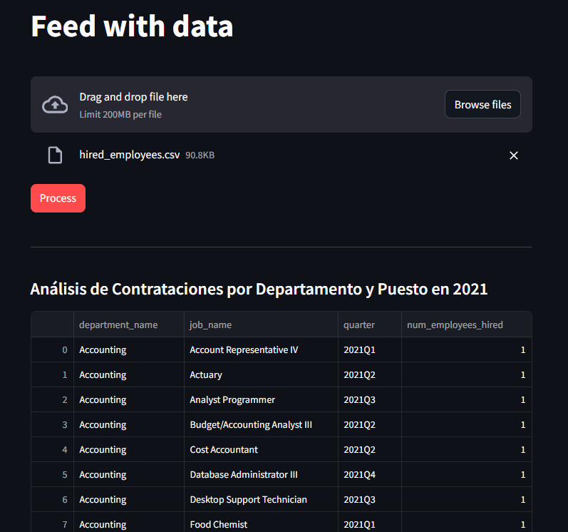
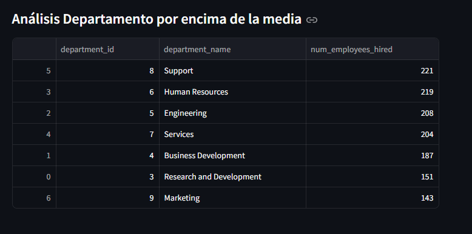
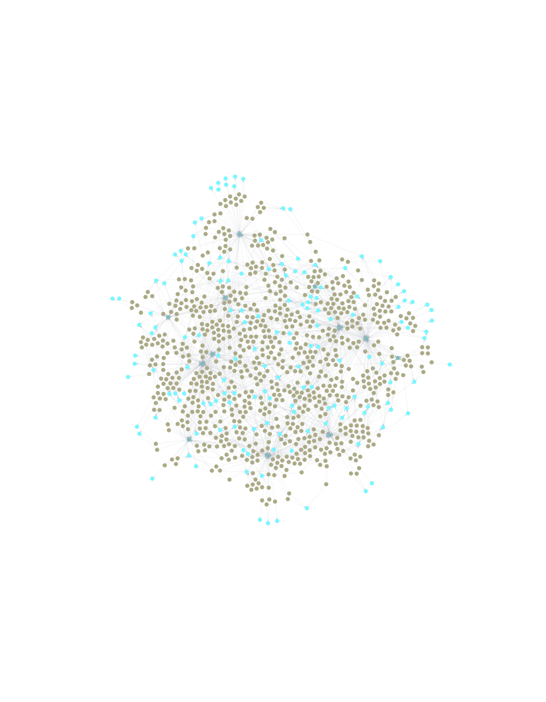

# Data_App


The main goal of this data application is to begin with a set of structured data in CSV format and use both structured and unstructured techniques to extract valuable insights. The application aims to facilitate answer business questions and opens the door to knowledge mining, enabling deeper understanding and discovery from the data using Knowledge Graphs.


### Install

`pip install -r requirements`


### Run

- In order to work  you will need to start a uvicorn service for FastApi

`uvicorn app/main:app --reload`

- To check the docuemntation and play with the endpoints from the API you can ho here:

`http://127.0.0.1:8000/docs`

**Note**: The main endpoints query the graph database.


- After that you will need to start the streamlit service for interacting with the frontend app.

`streamlit run app/frontend.py`

**Note**: You can upload CSV files directly, and after the files are upload you can process together to anser business questions





### Data Inspection




If you want to dynamic interaction with  the knowledge graph created from the CSV populated on the app you can access to the workbench of [AuraDB](https://workspace-preview.neo4j.io/) from **neo4j** and insert the URI and pass


```shell

uri = "neo4j+s://a575d5a9.databases.neo4j.io:7687
pass = ""yIjVz15ZVDbIFAyjLdA8tjacG-Re7_Cd8G_rY5YesTo"

```


### Notes

- The mini-project can continue evolve to a data analityc tool for better insigth discovery, improved recomendations, understanting the community using graph machine learnign algorithm and graph analytics, for example, most relevant departments and most influential persons of the network can be easily calculated
